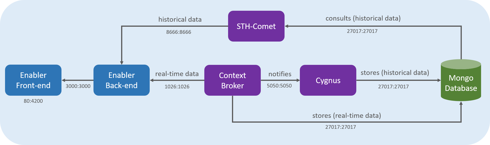

# Technical documentation

The technical documentation focuses in the technical aspects of the Context Broker Data Visualization enabler, as well as it explains how to develop new features or how specific parts of the enabler work.

## Content

- [Launch the application for development](#launch-the-application-for-development)
  - [Prerequisites](#prerequisites)
  - [Installation](#installation)
  - [Usage](#usage)
- [Architecture](#architecture)
  - [Context Broker](#context-broker)
  - [Cygnus](#cygnus)
  - [STH-Comet](#sth-comet)
  - [MongoDB](#mongodb)
  - [Enabler Back-end](#enabler-back-end)
  - [Enabler Front-end](#enabler-front-end)
- [Used technologies](#used-technologies)
- [Understanding the code](#understanding-the-code)
  - [How to change the refresh time of the information](#how-to-change-the-refresh-time-of-the-information)
  - [How to change historical data dashboards](#how-to-change-historical-data-dashboards)
  - [How to change notifications dashboard](#how-to-change-notifications-dashboard)
  - [How to change polygon colors](#how-to-change-polygon-colors)
  - [How the information of the map is updated](#how-the-information-of-the-map-is-updated)
  - [Supported types of locations](#supported-types-of-locations)
  - [Supported types of subscriptions](#supported-types-of-subscriptions)
    - [Subscriptions for a specific ID with multiple attributes](#subscriptions-for-a-specific-id-with-multiple-attributes)
    - [Subscriptions for a group of entities of the same type with multiple attributes](#subscriptions-for-a-group-of-entities-of-the-same-type-with-multiple-attributes)
    - [Subscriptions for a group of entities with an idPattern with multiple attributes](#subscriptions-for-a-group-of-entities-with-an-idpattern-with-multiple-attributes)
 

### Launch the application for development

To use the application, it is recommended to follow the [deployment manuals](../tutorials/index.md). However, to launch the application for development purposes, follow these instructions.

#### Prerequisites

- [Git](https://git-scm.com/downloads)
- [Nodejs](https://nodejs.org/es/)
- [Visual Studio Code](https://code.visualstudio.com/)

#### Installation

Execute the following commands:

```bash
git clone https://github.com/ConnectingEurope/Context-Broker-Data-Visualisation.git
cd Context-Broker-Data-Visualisation
npm install -g @angular/cli
cd client
npm install
cd ../server
npm install
```

#### Usage

To launch the application, execute the following command in the **client** and **server** folders.

```bash
npm start
```

Then, access to the application here: [localhost:4200](localhost:4200)

### Architecture

The following image represents the architecture of the Context Broker Data Visualization enabler and its integration with the rest of the tools:



> *Illustration 1. Architecture of the Context Broker Visualization enabler*

It is recommended to read the links of the [Reference documentation](../../README.md#reference-documentation) section before continuing reading the rest of this documentation.

Hereunder, the set of tools of the architecture are going to be detailed:

#### Context Broker

The Context Broker is responsible of providing real-time data to the Back-end of the enabler. The most recent information is stored in the MongoDB.

It is also integrated with Cygnus and, optionally, it notifies the changes of the data to Cygnus, by the subscriptions.

By default, it serves on the port 1026.

More information of the Context Broker can be found [here](https://fiware-orion.readthedocs.io/en/2.4.0/).

[Top](#technical-documentation)

#### Cygnus

Through its integration with the Context Broker, Cygnus is subscribed to the changes of the real-time data information.

Because of that, Cygnus generates historical data, storing all the data that is received in the MongoDB.

By default, it serves on the port 5050.

More information of Cygnus can be found [here](https://fiware-cygnus.readthedocs.io/en/1.18.3/).

[Top](#technical-documentation)

#### STH-Comet

Once the MongoDB contains historical data (generated by the integration of the Context Broker and Cygnus), STH-Comet is in charge of read the historical data information, and also to generate aggregated data (averages, etc.).

It provides the historical data information to the Enabler Back-end.

By default, it serves on the port 8666.

More information of STH-Comet can be found [here](https://fiware-sth-comet.readthedocs.io/en/latest/).

[Top](#technical-documentation)

#### MongoDB

MongoDB is the database which stores both real-time data (from the Context Broker) and historical data (from Cygnus).

It also provides the information to the rest of the tools, when they need to read the data.

By default, it serves on the port 27017.

More information of MongoDB can be found [here](https://www.mongodb.com/).

[Top](#technical-documentation)

#### Enabler Back-end

The Back-end of the enabler is a NodeJS module that acts as the server of the Front-end of the enabler.

It is responsible of sending all the requests to the Context Broker and STH-Comet, managing all the data of the enabler.

It also stores the configuration of the Configuration page in an internal JSON file called configuration.

By default, it serves on the port 3000.

[Top](#technical-documentation)

#### Enabler Front-end

The Front-end of the enabler consists on the visualization layer. It contains all the views of the enabler (map, configuration, historical data, etc.) and requests all the information to be displayed directly to the Back-end.

By default, it serves on the port 80.

[Top](#technical-documentation)

### Used technologies

The following technologies have been used for the development and the deployment of the Context Broker Data Visualization enabler:

- [Angular](https://angular.io/)
- [OpenStreetMap](https://www.openstreetmap.org/)
- [Leaflet](https://leafletjs.com/)
- [NodeJS](https://nodejs.org/)
- [MongoDB](https://www.mongodb.com/)
- [Docker](https://www.docker.com/)
- [GitHub](https://github.com/)
- [Orion Context Broker](https://github.com/telefonicaid/fiware-orion)
- [FIWARE lab](https://www.fiware.org/developers/fiware-lab/)
- [Markdown](https://www.markdownguide.org/)
- [Python](https://www.python.org/)
- [Elasticsearch](https://www.elastic.co/es/)
- [Kibana](https://www.elastic.co/es/kibana)
- [Apache Nifi](https://nifi.apache.org/)
- [Apache ZooKeeper](https://zookeeper.apache.org/)
- [MySQL](https://www.mysql.com/)


[Top](#technical-documentation)

### Understanding the code

The objective of this section is to explain different technical aspects of the enabler, including new developments, modifying parts of the enabler, etc.

[Top](#technical-documentation)

#### How to change the refresh time of the information

By default, the refresh time of the real-time data in the map is 1 minute. In milliseconds, it is 60000.

This refresh time can be changed, modifying a the value of a variable in the map-dashboard.component.ts.

```typescript
    private intervalRefreshMilliseconds: number = 60000;
```

In this case, the value of the *intervalRefreshMilliseconds* variable (60000) can be replaced by the desired refresh time (in milliseconds).

[Top](#technical-documentation)
### How to change historical data dashboards
The dashboards of the enabler are generated using [Kibana](https://www.elastic.co/es/kibana).

The following steps explain how to change the current kibana dashboards to another dashboard.
 1. Open the **historical-dashboard.component.ts** and **historical-dashboard.component.html** files.
 2. In the **historical-dashboard.component.ts**, there are the different links to each dashboard which will be replaced with the desired URL dashboard and a variable used to switch between dashboards:
```typescript
public firstDashboard: any ="http://link-to-first-dashboard.com";
public secondDashboard: any ="http://link-to-second-dashboard.com";
public dashboardRef: any;

```
 3. The name of the variable should be replaced as well with a descripting name.
 4. It needs a sanitiizer to enable the URL as a secure source and a default dashboard to be displayed:
 ```typescript
    constructor(private sanitizer: DomSanitizer){
    this.dashboardRef = this.sanitizer.bypassSecurityTrustResourceUrl(this.firstDashboard);
    }
 ```
 5. Once all the different links has been changed, we will need to change the switch that acts as a orchestrator to get the proper dashboard link:
 ```typescrypt
 public changeDashboard(dashboard: string): void{
  swtich(dashboard){
    case 'first':
      this.dashboardRef = this.sanitizer.bypassSecurityTrustResourceUrl(this.firstDashboard);
      break;
    case 'second':
      this.dashboardRef = this.sanitizer.bypassSecurityTrustResourceUrl(this.secondDashboard);
      break;
  }
 }
 ```
 6. In the **historical-dashboard.component.html**, add the needed buttons by copying the existing one and change the name and the string passed to the function:
 ```html
<button class="btn text-white mx-1 col-12 col-auto float-right" (click)="changeDashboard('first')">First dashboard</button>
<button class="btn text-white mx-1 col-12 col-auto float-right" (click)="changeDashboard('second')">Second dashboard</button>

```
7. The new dashboards will be displayed if the links are properly set 

[Top](#technical-documentation)
### How to change notifications dashboard

[Top](#technical-documentation)

### How to change polygon colors

[Top](#technical-documentation)
#### How the information of the map is updated

In order to optimize the load and update of the information of the map, it is updated based on the following actions:

- For the first load of information (after completing the configuration on the Configuration page), all the sensors are situated on the map. Additionally, the loaded attributes are:
  - ID
  - Type
  - Location
  - Main attribute. More information can be found [here](../user/index.md#configuring-main-attributes).

- Once the initial load of information is completed, the previous attributes are updated every 60 seconds by default. This action allows to visualize sensors whose location is changing during the time (i.e. buses).

- The rest of attributes are updated when the user clicks on a sensor, showing the visualization panel.

- Additionally, when a filter is added, the values for the selected attributes as filters are also automatically updated every 60 seconds by default.

The previous procedure optimizes the load of information and allows to manage high amounts of information in the enabler, avoiding efficiency problems.

[Top](#technical-documentation)

#### Supported types of locations

The supported types of locations of the sensors are [GeoJSON](https://geojson.org/).

This is an example:

```json
"location": {
    "type": "geo:json",
    "value": {
        "type": "Point",
        "coordinates": [-3.712247222222222, 40.423852777777775]
    }
},
```

The **location** attribute of the sensors has to follow the previous schema. The type of the coordinates has to be **Point** or **Polygon**, and its value has to be a **list of two coordinates**. Otherwise, the sensors won't be supported in the enabler (i.e. LineString).

[Top](#technical-documentation)

#### Supported types of subscriptions

With the objective of generating historical data, Cygnus is subscribed to the Context Broker. Then, when the Context Broker receives new data and, if this data matches with the configuration of the subscription, it is sent to Cygnus (and stored in MongoDB).

There are some examples for subscriptions in this [link](https://documenter.getpostman.com/view/513743/RWEgqe8Q?version=latest#5ae8856f-954c-4e6b-a577-e03644bebb70).

In relation with the subscriptions, there are lots of possibilities to configure them. Depending on the IDs of the entities, their attributes, the conditions for the notification, etc.

For the Context Broker Data Visualization enabler, the **supported subscriptions** between Cygnus and the Context Broker are:

##### Subscriptions for a specific ID with multiple attributes

This type of subscription is focused on the entity whose ID is the same as the one indicated in the request. Concretely, in the **id** key.

All the desired attributes to be subscribed for the specific entity, need to be included in the **notification -> attrs list**.

This is the structure of the request for this kind of subscription:

**URL:** <http://localhost:1026/v2/subscriptions/>

```json
{
  "description": "Notify Cygnus the changes of the attributes for the entity ENTITY_ID_1",
  "subject": {
    "entities": [
      {
        "id": "ENTITY_ID_1",
        "type": "TYPE_OF_THE_ENTITY"
      }
    ],
    "condition": {
      "attrs": []
    }
  },
  "notification": {
    "http": {
      "url": "http://cygnus:5051/notify"
    },
    "attrs": [
      "ATTRIBUTE_1",
      "ATTRIBUTE_2",
      "ATTRIBUTE_N"
    ]
  }
}
```

[Top](#technical-documentation)

##### Subscriptions for a group of entities of the same type with multiple attributes

This type of subscription is focused on a **group of entities of the same type**.

All the desired attributes to be subscribed for the specific entity, need to be included in the **notification -> attrs list**.

This is the structure of the request for this kind of subscription:

**URL:** <http://localhost:1026/v2/subscriptions/>

```json
{
  "description": "Notify Cygnus the changes of the attributes for the entities of type TYPE_OF_THE_ENTITIES",
  "subject": {
    "entities": [
      {
        "idPattern": ".*",
        "type": "TYPE_OF_THE_ENTITIES"
      }
    ],
    "condition": {
      "attrs": []
    }
  },
  "notification": {
    "http": {
      "url": "http://cygnus:5051/notify"
    },
    "attrs": [
      "ATTRIBUTE_1",
      "ATTRIBUTE_2",
      "ATTRIBUTE_N"
    ]
  }
}
```

[Top](#technical-documentation)

##### Subscriptions for a group of entities with an idPattern with multiple attributes

This type of subscription is focused on a **group of entities of the same type**, whose **id** matches the regex of the **idPattern** key.

All the desired attributes to be subscribed for the specific entity, need to be included in the **notification -> attrs list**.

This is the structure of the request for this kind of subscription:

**URL:** <http://localhost:1026/v2/subscriptions/>

```json
{
  "description": "Notify Cygnus the changes of the attributes for the entities of type TYPE_OF_THE_ENTITIES which IDs start by PARKING",
  "subject": {
    "entities": [
      {
        "idPattern": "PARKING.*",
        "type": "TYPE_OF_THE_ENTITIES"
      }
    ],
    "condition": {
      "attrs": []
    }
  },
  "notification": {
    "http": {
      "url": "http://cygnus:5051/notify"
    },
    "attrs": [
      "ATTRIBUTE_1",
      "ATTRIBUTE_2",
      "ATTRIBUTE_N"
    ]
  }
}
```

[Top](#technical-documentation)
