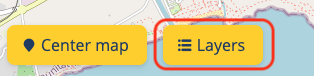

# User manual

The aim of this document is to create a **functional guide** to ensure the understanding of the enabler, so the users are able to exploit it to its fullest.

The **Context Broker Data Visualisation** enabler has been created to ease the understanding of the Context Broker and its data, and to fasten its learning curve for new stakeholders who would like to experiment with it. therefore, it consists in a visualisation layer over the Context Broker, used for playground purposes.

The enabler is available for use in local or remote environments (like the FIWARE lab). A [deployment manual](../tutorials/index.md) is also available to facilitate the implementation and deployment of the enabler.

The enabler gives the opportunity to experiment with a sensor’s real-time data as well as historical data, if configured. Having selected a range of time, it can be represented in a table or graph format, or even downloaded in a CSV file to further exploit.

## Contents

- [How to start](#how-to-start)
  - [How to access the enabler](#how-to-access-the-enabler)
  - [Initial configuration assistant](#initial-configuration-assistant)
- [Configuration](#configuration)
  - [Configuring Context Broker](#configuring-context-broker)
    - [Services](#services)
    - [Configuring main attributes](#configuring-main-attributes)
    - [Subscriptions Overview](#subscriptions-overview)
  - [Saving the configuration](#saving-the-configuration)
- [Dashboard](#dashboard)
  - [Map](#map)
    - [Main attributes](#main-attributes)
  - [Historical data](#historical-data)
  - [Sensors](#sensors)
    - [RAW data Overview](#raw-data-overview)
    - [Historical data Overview](#historical-data-overview)
  - [Location Search Bar](#location-search-bar)
  - [Managing the sensors](#managing-the-sensors)
    - [Layers](#layers)
    - [Filters](#filters)

## How to start

This section describes how to start using the Context Broker Data Visualisation enabler, once it has been deployed on a local or remote server.

[Top](#user-manual)

### How to access the Enabler

Once the Enabler has been deployed either on a local or remote server, the user will be able to access it via a web browser, as this Enabler is a web application.

In order to access it, the user should introduce in the web browser’s search bar the URL where the Enabler has been deployed, i.e. *localhost* is set by default.

>*Illustration 1. Enabler's URL.*

[Top](#user-manual)

### Initial configuration assistant

When the user accesses the Enabler for the first time, the first step is to configure a Context Broker instance in order for data to start flowing. Hence, an information panel will appear giving the user the option to begin this configuration through the **Configuration page**.

> *Illustration 2. Initial configuration pop-up*

[Top](#user-manual)

## Configuration

With the purpose of facilitating the integration of one or multiple Context Broker instances and historical data tools, the Enabler provides a visual and intuitive configuration panel. The user will be able to use this panel to configure the information that is desired to be visualized.

This Configuration page is divided into different sections, for the configuration of the Context Broker (including its services) or the historical data tools.

If the tools to be used have been configured following the [tutorials for deployment](../tutorials/index.md#tutorials-for-deployment) of the enabler, the URLs to be configured are defined [here](../tutorials/index.md#connection-between-enabler-and-fiware-tools).

[Top](#user-manual)

### Configuring Context Broker

The **Add Context Broker** button should be pressed to starting configuring a new Context Broker instance.

The user should introduce the desired name for that particular Context Broker instance and the URL where the data is available. Note that there may be a need to indicate the Context Broker’s port if the instance is serving in a specific one. For instance, if it is configured in a local environment and the port number is 1026, the URL should be *localhost:1026*.

Before proceeding, it is recommended to check the status of the Context Broker instance to ensure that the configuration provided is valid and ready to be used. This can be done by pressing the yellow checkbox next to the URL.

>*Illustration 3. Configuration Panel*

>*Illustration 4. Adding a new Context Broker*

If the URL introduced for the Context Broker is incorrect, the user will be informed with an unsuccesful connection message under the URL input.

>*Illustration 5. Incorrect Context Broker URL.*

After the initial configuration of the Context Broker instance is done, the user must choose the desired entities and attributes to be displayed in the enabler by pressing the **Choose entities and attributes** button.

>*Illustration 6. Successful Context Broker connection.*

>*Illustration 7. Selecting the entities and attributes.*

The entities and attributes can be selected and unselected by pressing the checkbox or the name of the desired option. **At least one entity must be selected**, otherwise an error message will appear.

If various Context Broker instances are configured, they will appear as a group of tabs where each one can be displayed for its edition. In order to delete a Context Broker instance, the bin icon must be pressed. A confirmation message will appear asking the user to confirm the action.

>*Illustration 8. Context Broker List.*

>*Illustration 9. Deleting a Context Broker.*

[Top](#user-manual)

#### Services

The information of a Context Broker instance can be organized and divided in what is called **Services**. By using these services, the information can be encapsulated in different logical groups and their access has to be granted.

The aim of the services, which are optional, is to increase the security of the Context Broker's data. A user may have access to one service but not to the rest. Therefore, the user has the option of adding a service if necessary.

More information of services can be found [here](https://fiware-orion.readthedocs.io/en/master/user/service_path/index.html).

If the user has access to one or several services, they can be added, edited and eliminated in the enabler. In order to add a new service to a Context Broker instance, the **The context Broker uses services** checkbox must be selected. A new panel with the **Services configuration** will be opened where the user will be able to start configuring them.

>*Illustration 10. Configuring services.*

The user will be able to create services by pressing the **Add service** button.

>*Illustration 11. Adding services.*

The user will need to configure the name of the service and, if needed, the service path. To check its availability, the **Choose entities and attributes** button should be pressed. If the configuration is incorrect, the user will be informed with an entities not found message under the button.

>*Illustration 12. Incorrect service name.*

>*Illustration 13. Incorrect service path.*

If the configuration is correct, a **list of the available entities and attributes** will appear, where the user will be able to **select or unselect the desired ones**. **At least one entity must be selected**, otherwise an error message will appear.

>*Illustration 14. Correct service name and path.*

>*Illustration 15. Error message for no entities selected.*

If various services are configured, they will appear as a group of tabs where each one can be displayed for its edition. In order to delete a service, the garbage icon must be pressed. A confirmation message will appear asking the user to confirm the action.

>*Illustration 16. List of services.*

>*Illustration 17. Deleting a Service.*

[Top](#user-manual)

#### Configuring main attributes

Once the entities and the attributes of the Context Broker instance (or one of its services) have been selected, the user will be able to select one single main attribute of the entity by pressing the **star icon**. This **main attribute** represents the data that will be **statically displayed** on the map next to the geo-localized sensor.

The user will **only be allowed to select one main attribute per each category**.

>*Illustration 18. Configuring main attributes*

This information will be explained in the [Main attributes section](#main-attributes) of this document.

[Top](#user-manual)

### Saving the configuration

Once the user has finished configuring the Context Broker instance, its services and tools, the **Apply Configuration** button at the top of the page must be pressed to save the overall configurations. **Otherwise, the current configuration will not be effective**.

>*Illustration 24. Saving the configuration.*

[Top](#user-manual)

## Dashboard

### Map

The map that supports the Enabler is the open source World map [OpenStreetMap](https://www.openstreetmap.org/).

The Enabler supports the use of various Context Broker instances, therefore, all of the information contained in the configured Context Broker instances is shown on the map with the real-time data they provide.

Regarding the representation of the sensors, all of them must have coordinates for their geo-location and, taking advantage of those coordinates, they can be displayed directly over the map.

When zooming out of the map, the icons will start to cluster together in a single notification, showing the number of sensors available in the area. As the user zooms in, the sensors will start to separate and appear in the exact locations.

>*Illustration 25. The Enabler Map.*

[Top](#user-manual)

#### Main attributes

The user is be able to select one single main attribute for each entity from the Configuration page. If an important attribute has been configured, the visualisation of the map will include the visualisation of the selected main attribute.

The user will also be able to visualize on a side panel the list of main attributes selected for each type of sensor.

>*Illustration 26. Main attributes over the sensors*

The enabler will also give the user the possibility to **enable or disable the display of the main attributes** and the side panel through a switch option.

>*Illustration 27. Main attributes disabled*

[Top](#user-manual)

### Sensors

The icons that appear on the map correspond to a list of categories that classifies the data in different groups depending on the type of information it gives:

</img>
**Alerts**: Alerts Events related to risk or warning conditions which require action taking.

</img>
**Smart Environment**: Domain repository for topics related with environment. Currently available Environment, Waster management and Weather.

</img>
**Environment**: Enable to monitor air quality and other environmental conditions for a healthier living.

</img>
**Point of interest**: Specific point locations that someone may find useful or interesting. For instance, weather stations, touristic landmarks, etc.

</img>
**Civic issue tracking**: Data models for civic issue tracking interoperable with the de-facto standard Open311.

</img>
**Street lighting**: Modeling street lights and all their controlling equipment towards energyefficient and effective urban illuminance.

</img>
**Device**: IoT devices (sensors, actuators, wearables, etc.) with their characteristics and dynamic status.

</img>
**Transportation**: Transportation data models for smart mobility and efficient management of municipal services.

</img>
**Indicators**: Key performance indicators intended to measure the success of an organization or of a particular activity in which it engages.

</img>
**Waste management**: Enable efficient, recycling friendly, municipal or industrial waste management using containers, litters, etc.

</img>
**Parking**: Real time and static parking data (on street and off street) interoperable with the EU standard DATEX II.

</img>
**Weather**: Weather observed, weather forecasted or warnings about potential extreme weather conditions.

</img>
**Generic**: For other categories not included in the FIWARE data models.

If more information about these categories is needed, the FIWARE data models can be consulted through this [link](https://www.fiware.org/developers/data-models/).

Whenever a geo-localized sensor is selected on the map, an information panel with the sensor’s information will appear. This panel will contain the attributes that were selected while configuring the Context Broker instance along with the real time data they have available.

>*Illustration 28. Example of pop-up attributes.*

>*Illustration 29. Sensor pop-up.*

If the user unselects any of the attributes in the configuration of the desired Context Broker instance, they will disappear from the pop-up as seen in the information panel.

>*Illustration 30.Example of unselecting pop-up attributes.*

>*Illustration 31. Same information panel without the attributes.*

>*Illustration 32. Sensor's information panel characteristics.*

Apart from showing the real-time data of the sensor, the information panel offers two other functionalities: **raw data overview** and **historical data overview**.

[Top](#user-manual)

#### RAW data Overview

The RAW data Overview consists in showing the **sensor’s information in a RAW format, just as the Context Broker provides it**, without being processed. This raw information will appear in a side panel.

The user will be able to copy the complete JSON by pressing on the **Copy** button.

>*Illustration 33. RAW data Overview*

[Top](#user-manual)
### Historical Data
A new page has been added in order to see the historical data persisted from the sensors. The user can access to it using the top menu link, which will redirect to this specific page. It contains Kibana dashboards with graphs, charts and tables to display the historical data. Different dashboards has been added to separate group the info depending on the data souces.

>*Illustration 34. Historical data dashboard*

To switch between the different dashboards, the user will use the buttons placed at the top-right of the page by clicking the proper button, which have a descriptive name.

>*Illustration 35. Buttons to switch between different Kibana dashboards*

[Top](#user-manual)

### Location Search Bar

A search bar is available to localize cities on the map in a faster way. The user will have to introduce the name of the city they wish to see and, after selecting one of the results, the map will automatically change its focus to the city.

>*Illustration 45. Using the search bar.*

[Top](#user-manual)

### Managing the sensors

The user will be able to add dynamic filters to hide or show certain sensors on the map in case they want to focus in a specific aspect of any of the attributes. For instance, if there is a need to localize the higher priority risk alerts in order to take actions faster.

There are **two types of filters** available: the first is the **layers** option, based on checking or unchecking entities/attributes to be displayed, and the second is the **filters** option, based on filtering sensors based on attribute's conditions.

>*Illustration 46. Filtering Options.*

[Top](#user-manual)

#### Layers

This option is available by clicking the **Layers** button. Its objective is to show/hide types of sensors on the map by selecting/unselecting, respectively, the checkboxes next to the desired variables.

>*Illustration 47. Selecting entities and attributes.*

**This configuration is not stored**, so it will be discarded after closing the enabler.

[Top](#user-manual)

#### Filters

In order to add a new condition to any of the attributes of the current sensors, the user has to press the **Filters** button.

The objective of this functionality is to provide a filter mechanism to show the sensors that match the specified conditions and hide the ones that do not. For instance, the user would like to visualize only the parking sensors that have more than 50 free slots.

>*Illustration 48. Adding a condition.*

>*Illustration 49. After the Condition is Added.*

This filtering mechanism is dynamically generated based on the configured data of the Context Broker instance. The creation of a specific condition is done by steps:

1. The user will have to select the category.
2. The user will have to select the entity.
3. The user will have to select the attribute. Depending on its type (text or numeric), a different type of filter will appear and the user will be able to add the desired condition.

The types of conditions are the following:

- Numeric conditions. The user introduces the desired numeric value and chooses between:
  - Greater than “>”.
  - Greater or equal to “>=”.
  - Less than “<”.
  - Less or equal to “<=”.
  - Equal to “=”.
- Text conditions:
  - Contains “Word”.
  - Has prefix or suffix.

After choosing the desired condition, the user will have to write the comparing value in the empty box and press the **Add** button.

By pressing the **Clear** button, the user will be able to clear the current filter condition that is being created. In order to delete an existing filter condition, the user should press the bin icon. Furthermore, to delete all the existing filters, the **Clear** all button should be pressed.

[Top](#user-manual)
